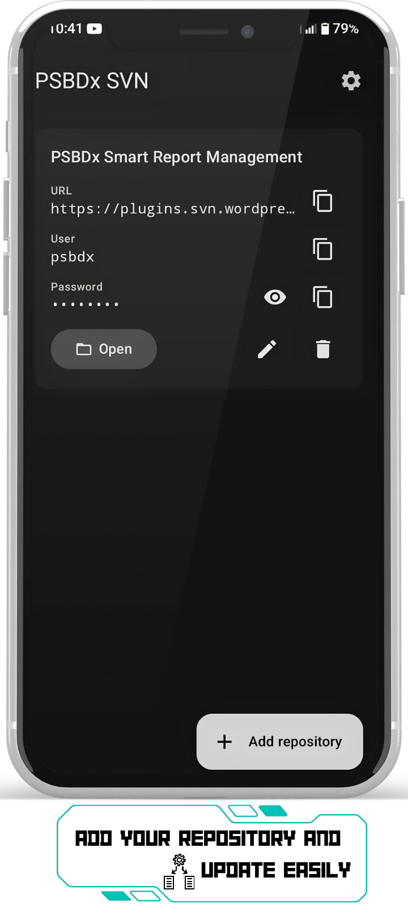
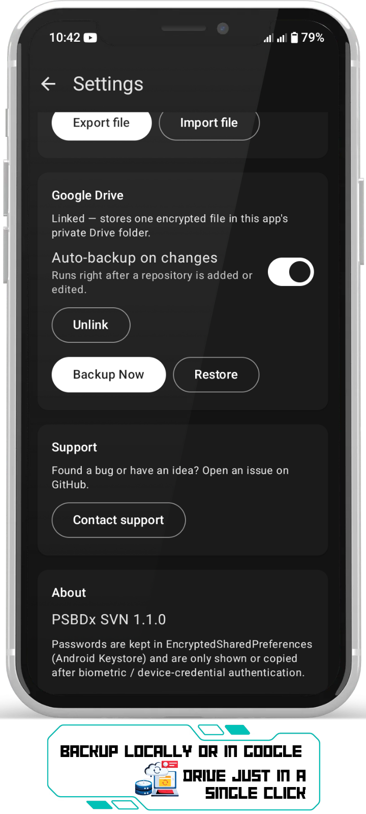
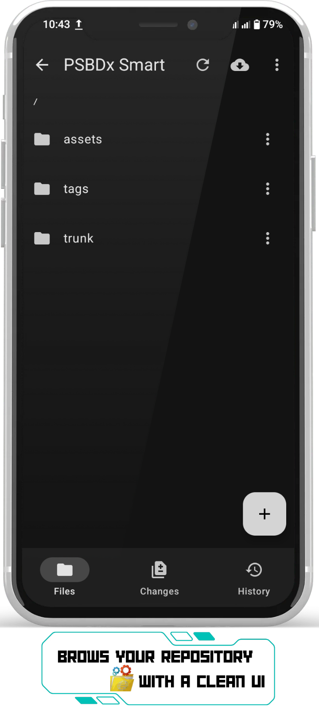
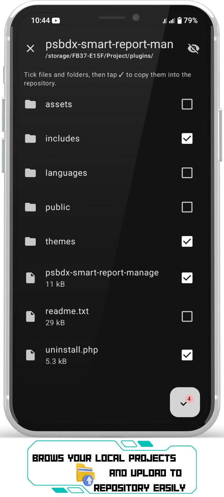
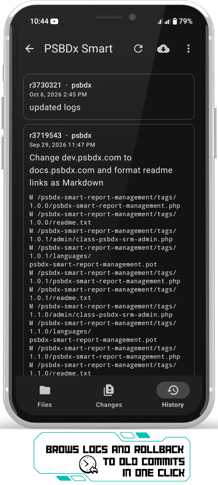

# 🚀 PSBDx-SVN


---

<div align="center">

### ⭐ Star this repository if you find it useful!

[](https://github.com/m-farhan-hamim/PSBDx-SVN)
[](https://github.com/m-farhan-hamim/PSBDx-SVN/fork)

</div>

---
<div align="center">

[](https://github.com/m-farhan-hamim/PSBDx-SVN)
[](https://www.virustotal.com/gui/file/f6d93c81592dc89cf58886b93d05f4158132b96ff51fb86205215a8b760fcdf3/details)
[](https://f-droid.org/)
[](https://www.gnu.org/licenses/gpl-3.0)

**A modern, lightweight Android SVN client built with ❤️ for developers on the go.**

[📥 Download APK](#-download) · [🐛 Report Bug](https://github.com/m-farhan-hamim/PSBDx-SVN/issues) · [💡 Request Feature](https://github.com/m-farhan-hamim/PSBDx-SVN/issues)

</div>

---

## 📖 Table of Contents

- [About](#-about)
- [✨ Features](#-features)
- [📸 Screenshots](#-screenshots)
- [📥 Download](#-download)
- [🛡️ Security & VirusTotal](#️-security--virustotal)
- [📱 Compatibility](#-compatibility)
- [🛠️ Installation](#️-installation)
- [🔧 Building from Source](#-building-from-source)
- [🤝 Contributing](#-contributing)
- [📄 License](#-license)
- [🙏 Acknowledgments](#-acknowledgments)

---

## 📖 About

**PSBDx-SVN** is a fully open-source Android application that brings Subversion (SVN) version control to your mobile device. Whether you're a developer who needs to check out a repository on the go, review commit logs, or make quick edits, PSBDx-SVN provides a clean and intuitive interface for managing your SVN workflows directly from your Android phone or tablet.

Built with a focus on performance and usability, this app is designed for developers, system administrators, and anyone who works with SVN repositories regularly.

> **Why PSBDx-SVN?**
> - 🪶 **Lightweight** – Minimal resource consumption (~14 MB)
> - 🔒 **Open Source** – Fully auditable GPLv3 code
> - 🎨 **Modern UI** – Clean, material design interface
> - ⚡ **Fast** – Optimized for quick repository operations
> - 📴 **Offline First** – Access your checked-out files anytime

---

## ✨ Features

- ✅ **Repository Browsing** – Navigate SVN repositories with an intuitive file explorer
- ✅ **Checkout & Update** – Pull the latest changes directly to your device
- ✅ **Commit Changes** – Stage, commit, and push changes with custom commit messages
- ✅ **Diff Viewer** – View file differences before committing
- ✅ **Commit History** – Browse revision logs with author and timestamp details
- ✅ **Multi-Repository Support** – Manage multiple SVN repositories simultaneously
- ✅ **Authentication** – Secure credential storage for private repositories
- ✅ **Dark Mode** – Eye-friendly dark theme support
- ✅ **Offline Access** – View previously checked-out files without network
- ✅ **Export & Share** – Export files or share repository links

> *Feature set may vary by version. Check the [Releases](https://github.com/m-farhan-hamim/PSBDx-SVN/releases) page for the latest updates.*

---

## 📸 Screenshots

<div align="center">

| App Home | Settings | SVN Folder Root (/) |
|:---:|:---:|:---:|
|  |  |  |

| Select Files to Upload | Log / History |
|:---:|:---:|
|  |  |

</div>

> 📁 All screenshots are located in [`fastlane/metadata/android/en-US/images/phoneScreenshots/`](fastlane/metadata/android/en-US/images/phoneScreenshots/). These are also used by F-Droid for the app listing.

---

## 📥 Download

<div align="center">

| Source | Status | Link |
|:---:|:---:|:---:|
| **GitHub Releases** | ✅ Available | [Download APK](https://github.com/m-farhan-hamim/PSBDx-SVN/releases) |
| **F-Droid** | ⏳ Coming Soon | *Not yet available* |
| **Google Play** | ⏳ Coming Soon | *Not yet available* |

</div>

### 📦 Latest Release

Check the [Releases](https://github.com/m-farhan-hamim/PSBDx-SVN/releases) page for the latest version, changelog, and APK downloads.

---

## 🛡️ Security & VirusTotal

The security and integrity of this application are of utmost importance. The official APK has been scanned using **VirusTotal**, a service that analyzes files with over 70 antivirus engines and URL/domain blocklisting services.

<div align="center">

[](https://www.virustotal.com/gui/file/f6d93c81592dc89cf58886b93d05f4158132b96ff51fb86205215a8b760fcdf3/details)

</div>

> **⚠️ Important:** Only download the APK from the official [GitHub Releases](https://github.com/m-farhan-hamim/PSBDx-SVN/releases) page or the future F-Droid listing.

---

## 📱 Compatibility

| Specification | Details |
|:---|:---|
| **Minimum Android Version** | Android 6.0 (Marshmallow) – API 23 |
| **Target Android Version** | Android 14 (Upside Down Cake) – API 34 |
| **Maximum Tested Android Version** | Android 14 (API 34) |
| **Architecture** | `arm64-v8a`, `armeabi-v7a` |
| **Package Name** | `com.dev.svn.psbdx` |
| **App Size** | ~14 MB |
| **Category** | Developer Tools |
| **Price** | Free & Open Source |

> *Minimum and target SDK versions are based on the current project configuration. Check the `build.gradle` file in the repository for exact values.*

---

## 🛠️ Installation

### Option 1: Install from APK (Sideload)

1. Download the latest APK from the [Releases](https://github.com/m-farhan-hamim/PSBDx-SVN/releases) page.
2. On your Android device, go to **Settings → Security → Install unknown apps** and allow installation from your file manager or browser.
3. Open the downloaded APK file and tap **Install**.
4. Once installed, open **PSBDx-SVN** from your app drawer.

### Option 2: Build from Source

See the [Building from Source](#-building-from-source) section below.

### Option 3: F-Droid (Coming Soon)

Once available on F-Droid, you can install PSBDx-SVN directly from the F-Droid client. Stay tuned for updates!

---

## 🔧 Building from Source

### Prerequisites

- **Android Studio** (Ladybug or newer) — [Download here](https://developer.android.com/studio)
- **JDK 17** or higher
- **Git** installed on your system
- **Android SDK** with API level 34 installed

### Steps

```bash
# 1. Clone the repository
git clone https://github.com/m-farhan-hamim/PSBDx-SVN.git

# 2. Navigate to the project directory
cd PSBDx-SVN

# 3. Open the project in Android Studio
#    File → Open → Select the PSBDx-SVN folder

# 4. Sync Gradle and build the APK
#    Build → Build Bundle(s) / APK(s) → Build APK(s)

# Or build from the command line:
./gradlew assembleDebug
```

The generated APK will be located at:

```
app/build/outputs/apk/debug/app-debug.apk
```

> **Tip:** Use `./gradlew assembleRelease` for a release build (requires signing configuration).

### F-Droid Build Note

This project uses the standard F-Droid `fastlane` metadata structure. If you're building for F-Droid, ensure the following directories exist:

```
fastlane/metadata/android/en-US/
├── title.txt
├── short_description.txt
├── full_description.txt
├── changelogs/
│   └── <versionCode>.txt
└── images/
    └── phoneScreenshots/
        ├── 1.png
        ├── 2.png
        ├── 3.png
        ├── 4.png
        └── 5.png
```

---

## 🤝 Contributing

Contributions are what make the open-source community such an amazing place to learn, inspire, and create. Any contributions you make are **greatly appreciated**.

### How to Contribute

1. **Fork** the repository
2. **Create** a feature branch (`git checkout -b feature/AmazingFeature`)
3. **Commit** your changes (`git commit -m 'Add some AmazingFeature'`)
4. **Push** to the branch (`git push origin feature/AmazingFeature`)
5. **Open** a Pull Request

### Guidelines

- Follow the existing code style and conventions
- Write clear commit messages
- Update documentation as needed
- Add tests for new features when possible
- Ensure your code passes all existing tests

### Reporting Bugs

Found a bug? Please open an [issue](https://github.com/m-farhan-hamim/PSBDx-SVN/issues) with:

- A clear description of the problem
- Steps to reproduce
- Expected vs. actual behavior
- Device model and Android version
- Screenshots (if applicable)

---

## 📄 License

This project is licensed under the **GNU General Public License v3.0 (GPL-3.0)**.

See the [LICENSE](https://github.com/m-farhan-hamim/PSBDx-SVN/blob/main/LICENSE) file for the full license text, or read the official GPL-3.0 license at [https://www.gnu.org/licenses/gpl-3.0](https://www.gnu.org/licenses/gpl-3.0).

---

## 🙏 Acknowledgments

- **M. Farhan Hamim (PSBDx)** — Creator and maintainer
- **GNU Project** — For the GPLv3 license
- **VirusTotal** — For providing free file analysis services
- **F-Droid** — For the upcoming distribution support
- **Open Source Community** — For inspiration and contributions

---

<div align="center">

**Made with ❤️ by [M. Farhan Hamim](https://github.com/m-farhan-hamim)**

</div>
